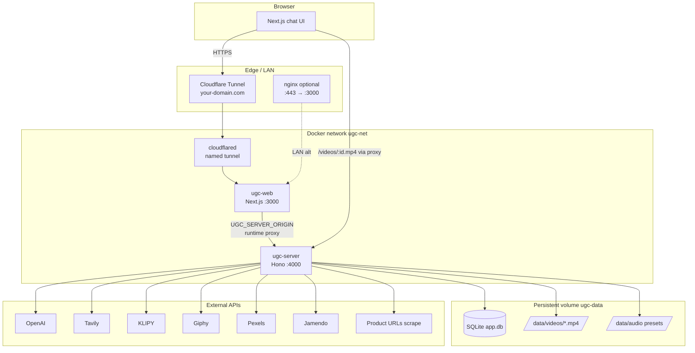
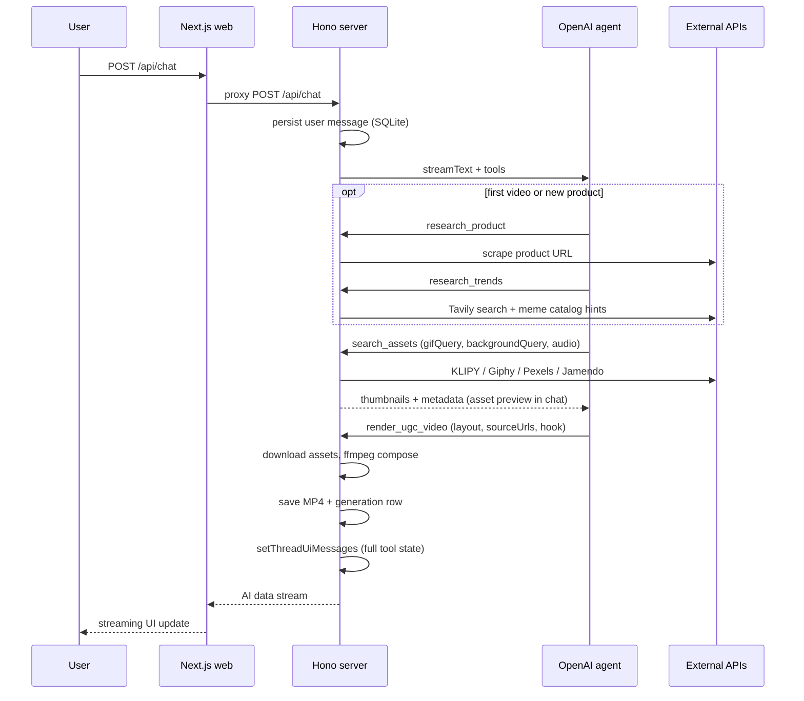
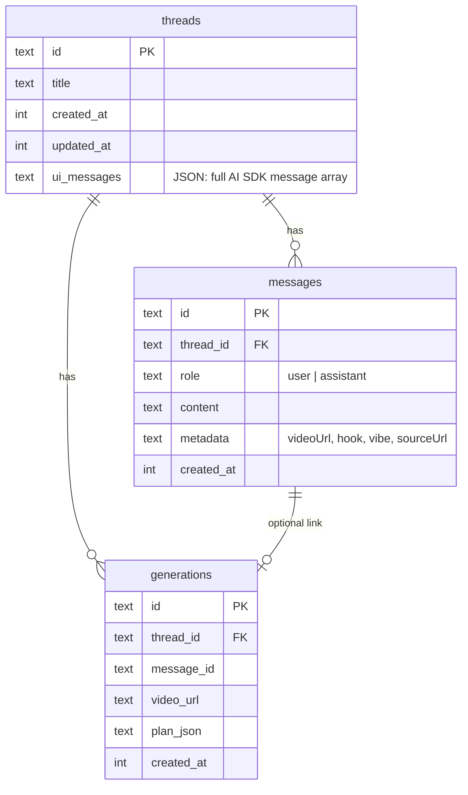
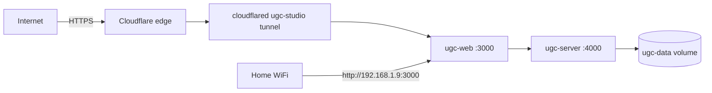

# UGC Studio

Agent-driven TikTok-style promo video generator. Chat with an AI creative director that researches your product, finds meme clips and backgrounds, and renders short vertical videos with ffmpeg.

## Stack

| Layer | Tech |
|-------|------|
| Runtime | [Bun](https://bun.sh) |
| Web | Next.js 15, React 19, Tailwind CSS 4, Vercel AI SDK |
| API | Hono (`apps/server`) |
| Agent | OpenAI tool-calling + streaming (`streamText`) |
| Pipeline | KLIPY / Giphy / Pexels / Jamendo / Tavily / ffmpeg |
| Storage | SQLite (WAL) + local MP4 files |

## Monorepo layout

```
apps/
  server/     # Hono API, chat streaming, video render, SQLite
  web/        # Next.js chat UI (proxies /api and /videos to server)
packages/
  types/      # Shared Zod schemas, API routes, env config
  db/         # SQLite persistence (threads, messages, generations)
  pipeline/   # Asset search, meme catalog, ffmpeg compose, agent tools
```

---

## Architecture

### High-level request flow



### Key design decisions

| Decision | Rationale |
|----------|-----------|
| **Split web + server** | Next.js for UI/streaming proxy; Bun+Hono for long-running ffmpeg renders and OpenAI idle timeouts |
| **Runtime API proxy** (`apps/web/src/lib/server-proxy.ts`) | `UGC_SERVER_ORIGIN` is read at request time, not baked into `next.config` rewrites — fixes Docker internal hostnames (`http://ugc-server:4000`) |
| **Dedicated `/api/chat` route** | Sets streaming headers (`Cache-Control`, `Connection`) for Vercel AI data stream |
| **SQLite + files** | Simple single-node deploy; no Redis/Postgres required |
| **Dual chat persistence** | Plain `messages` for sidebar/history + `threads.ui_messages` JSON for full AI SDK state (tool invocations, parts) |
| **Agent picks layout** | `full_bleed` vs `layered` chosen in `render_ugc_video`, not hardcoded in compose |
| **Meme catalog** | Maps famous meme names → searchable API queries (e.g. `confused math lady` → `confused nick young`); niche tags bias `research_trends` |
| **KLIPY → Giphy → Pexels** | Meme search order; relevance scoring demotes fuzzy word matches |
| **Cloudflare named tunnel** | Public HTTPS without router port-forward; CNAME to `{tunnel-id}.cfargotunnel.com` |

### Agent pipeline



**Tools (in order):**

1. **`research_product`** — scrape product URL (title, audience, features)
2. **`research_trends`** — Tavily web search + meme catalog for influencers, famous memes, hook patterns
3. **`search_assets`** — meme, background, and audio candidates with thumbnails
4. **`render_ugc_video`** — agent picks `layout`:
   - **`full_bleed`** — meme fills 9:16 frame (no Pexels background)
   - **`layered`** — aesthetic background + centered meme overlay

---

## Chat persistence



| What | Where | Purpose |
|------|-------|---------|
| Thread list / titles | `threads` | Sidebar, routing `/chat/[threadId]` |
| User + assistant text | `messages` | Durable history, video metadata on assistant rows |
| Tool cards / streaming reload | `threads.ui_messages` | Full `Message[]` with `toolInvocations` — restored via `toUiMessages()` |
| Rendered MP4s | `VIDEOS_DIR` (`/data/videos`) | Served at `{PUBLIC_URL}/videos/{id}.mp4` |
| Demo audio presets | `AUDIO_PRESETS_DIR` | Bootstrapped on server start if empty |

**Reload flow:** `GET /api/threads/:id/messages` returns `messages` + `uiMessages`. If `uiMessages` exists, the web client revives tool invocation state; otherwise it reconstructs video cards from assistant `metadata.videoUrl`.

**Message content:** API accepts `content` as string or AI SDK parts array; server normalizes via `getMessageText()` before persisting.

---

## External APIs

| Service | Env var | Used by | Endpoint / purpose |
|---------|---------|---------|-------------------|
| **OpenAI** | `OPENAI_API_KEY` | Chat agent, trend synthesis | Chat completions, `generateObject`, tool calling |
| **Tavily** | `TAVILY_API_KEY` | `research_trends` | `https://api.tavily.com/search` — TikTok/meme trend research |
| **KLIPY** | `KLIPY_API_KEY` | `search_assets` (memes) | `https://api.klipy.com/api/v1` — clips + gifs search (preferred) |
| **Giphy** | `GIPHY_API_KEY` | `search_assets` (memes) | GIF search, Clips API (needs `clips@giphy.com` approval), GIF→MP4 fallback |
| **Pexels** | `PEXELS_API_KEY` | `search_assets` | `https://api.pexels.com/videos/search` — backgrounds; meme last resort |
| **Jamendo** | `JAMENDO_CLIENT_ID` | `search_assets` (audio) | `https://api.jamendo.com/v3.0/tracks/` — background music |
| **Product URLs** | — | `research_product` | Direct HTTP fetch + HTML parse (no third-party scrape API) |

Optional model overrides: `OPENAI_MODEL` (chat), `PLAN_MODEL` (structured trend output).

---

## Local development

### Prerequisites

- Bun 1.2+
- ffmpeg and ffprobe on `PATH`
- API keys (see below)

### Setup

```bash
bun install
cp apps/server/.env.example apps/server/.env   # fill in keys
bun run seed:audio                              # first run: demo audio presets
bun run dev                                     # web :3000, server :4000
```

Open [http://localhost:3000](http://localhost:3000).

`apps/web` proxies `/api/*` and `/videos/*` to `UGC_SERVER_ORIGIN` (default `http://localhost:4000`).

### Environment variables

| Variable | Required | Description |
|----------|----------|-------------|
| `OPENAI_API_KEY` | Yes | Chat agent and tool orchestration |
| `PEXELS_API_KEY` | Yes | Background lifestyle videos |
| `GIPHY_API_KEY` | Yes | Meme GIF / clip fallback |
| `KLIPY_API_KEY` | No | Preferred meme clips with audio ([klipy.com/developers](https://klipy.com/developers)) |
| `JAMENDO_CLIENT_ID` | No | Background music search |
| `TAVILY_API_KEY` | No | Trend research (recommended) |
| `PUBLIC_URL` | No | Base URL for CORS + video URLs (default `http://localhost:3000`) |
| `UGC_SERVER_ORIGIN` | Web only | Upstream API for Next proxy (default `http://localhost:4000`) |
| `DATABASE_PATH` | No | SQLite path (default `./data/app.db`) |
| `VIDEOS_DIR` | No | Render output directory |
| `AUDIO_PRESETS_DIR` | No | Demo audio preset files |
| `FFMPEG_PATH` | No | ffmpeg binary (default `ffmpeg`) |

---

## Production deployment

Current production layout (home server):



| Component | Details |
|-----------|---------|
| **URL** | `https://your-domain.com` (Cloudflare named tunnel + DNS) |
| **LAN** | `http://192.168.1.9:3000` (no router changes needed) |
| **Containers** | `ugc-web`, `ugc-server`, `ugc-tunnel` on Docker network `ugc-net` |
| **Data** | Named volume `ugc-data` → SQLite + videos + audio (not synced from dev) |
| **Deploy** | `git pull` → `docker build` both images → restart containers |

```bash
# On server after git pull
docker build -f apps/server/Dockerfile -t ugc-server .
docker build -f apps/web/Dockerfile -t ugc-web .
# restart ugc-server + ugc-web (see docker-compose.yml for env flags)
```

`docker compose` works locally; production server uses manual `docker run` (no compose plugin installed).

**Note:** `OPENAI_API_KEY` in server `.env` must not have wrapping quotes. `PUBLIC_URL` must match the browser origin (e.g. `https://your-domain.com` in prod).

---

## Scripts

| Command | Description |
|---------|-------------|
| `bun run dev` | Start web + server in parallel |
| `bun run typecheck` | Typecheck all packages |
| `bun run seed:audio` | Generate demo Jamendo-style audio presets |

## Docker (local)

```bash
docker compose up --build
```

Web on `http://localhost:3000`, server internal on `http://server:4000`. Copy keys to `apps/server/.env` or root `.env`.

## License

Private — all rights reserved.
